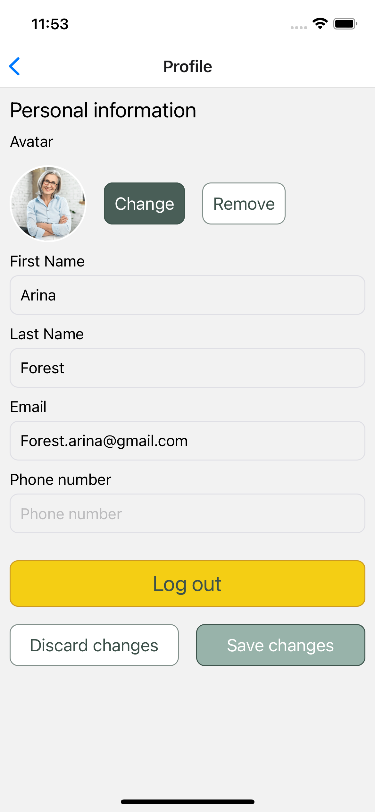

# Little Lemon App

This is a React Native App using Expo.
The application was originally developed using JavaScript, but is now moving to TypeScript.

Main features:

- Registration: Sign in with email verification
- Home screen with a list of dishes in a SectionList
- Search by the name of a dish with the Searchbar component
- Search by category with a custom component (CategoryList)
- Profile screen with user data saving functionality

## Technologies used

- React Native
- Atomic design
- AsyncStorage
- SQLite
- Expo

## Screenshots

<table>
  <tr>
    <td>
      
Login Screen

      
    </td>
    <td>
      
Main Screen

      
    </td>
    <td>
      
Profile Screen

      
    </td>
  </tr>
  <tr>
    <td>
      
Search by Category

      
    </td>
    <td>
      
Search by Name

      
    </td>
  </tr>
</table>

Planned:

- Moving the styles object to a separate file
- Implementing network layer
- Integrating MobX for State Management
